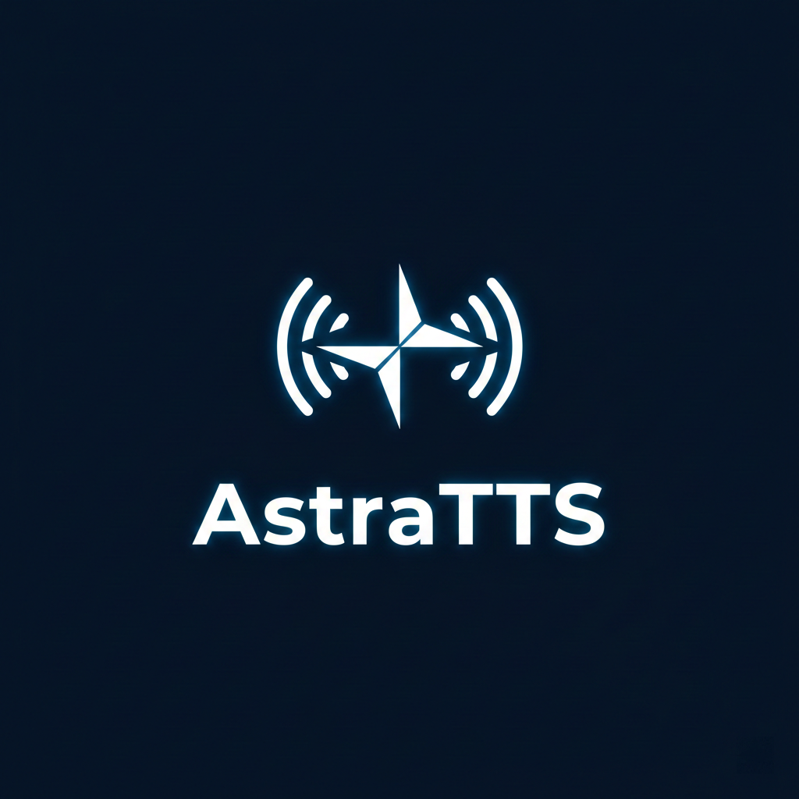

# AstraTTS

<p align="center">
  
</p>

<p align="center">
  <strong>🎙️ 高性能跨平台 TTS (Text-to-Speech) 引擎</strong>
</p>

<p align="center">
  基于 ONNX Runtime 的高质量语音合成解决方案，支持流式输出、基础多音色管理、低延迟播放。
</p>

<p align="center">
  <a href="./README_EN.md">English</a> | 简体中文
</p>

---

## 🚀 稳定版下载 (推荐)

如果你不想进行繁琐的编译环境配置，可以直接下载我们预构建的**整合包**：

👉 **[下载最新稳定版整合包](https://github.com/Blackwood416/AstraTTS/releases/latest)**

> [!TIP]
> 整合包已内置所有必需的运行时环境及 V1 默认音色，解压后即可按下方 [整合包使用说明](#-整合包使用说明) 运行。

---

## ✨ 特性

- 🚀 **高性能推理** - 基于 ONNX Runtime，针对 CPU 推理进行了深度优化。
- 🎵 **流式合成** - 实时流式输出音频，首包延迟极低，支持边合成边播放。
- 🎭 **多音色管理** - 支持自定义音色库及参考音频配置。
- 🔧 **灵活部署** - 提供交互式 CLI 工具和标准 Web API 服务。
- 🌐 **混合语言** - 内置中英文 G2P 系统，支持自然的中英文混读。
- 🔄 **热重载** - 支持在不停止服务的情况下动态重载配置文件。

## 📦 项目结构

- **AstraTTS.Core**: 核心 SDK，包含推理引擎、文本处理 (G2P/TextNorm) 及音频工具。
- **AstraTTS.CLI**: 命令行交互工具，支持一键合成及实时流式播放测试。
- **AstraTTS.Web**: 基于 ASP.NET Core 的 Web 服务，提供 RESTful API 及简单的 API 文档界面。

---

## 🔧 引擎版本对比

AstraTTS 支持两个版本的推理引擎。目前 **V1 为推荐使用的稳定版本**。

| 特性 | V1 引擎 (推荐) | V2 引擎 (实验性) |
| :--- | :--- | :--- |
| **项目来源** | 基于 [Genie-TTS](https://github.com/High-Logic/Genie-TTS) | 基于 [GPT-SoVITS-Minimal](https://github.com/GPT-SoVITS-Devel/GPT-SoVITS_minimal_inference) |
| **状态** | ✅ 稳定，生产就绪 | 🚧 开发中 (WIP)，波动较大 |
| **加速支持** | 仅 CPU (高度优化) | 仅 CPU (GPU 支持开发中) |
| **语速调节** | ✅ 支持 (`Speed`) | ✅ 支持 (`Speed`) |
| **采样参数** | ❌ 不支持 (TopK/Temp) | ✅ 支持 (`TopK`, `Temperature`) |
| **噪声系数** | ❌ 不支持 | ✅ 支持 (`NoiseScale`) |

#### 📂 模型与资源目录

资源主要存放于 `resources` 目录下：

- **V1 模型 (`resources/models_v1/default/`)**: 包含 `tts/`, `bert/`, `hubert/`, `speaker_encoder.onnx`。
- **V2 模型 (`resources/models_v2/default/`)**: 实验性 GPT-SoVITS 模型。
- **共享资源 (`resources/shared/`)**:
  - `dictionaries/cmudict.dict`: 英文发音词典。
  - `dictionaries/mandarin_pinyin.dict`: 中文拼音词典。
  - `dictionaries/opencpop-strict.txt`: 中文 G2P 核心词典。
  - `g2p/checkpoint20.npz`: 英文 Neural G2P 模型。
  - `custom_dict.txt`: 用户自定义词典（支持热更新）。

---

## 📦 整合包使用说明

1. **下载并解压** 整合包。
2. **启动 WebAPI**: 运行 `astra-server.exe`。默认在 `http://localhost:5000` 运行。
3. **本地测试**: 运行 `astra-cli.exe` 进入交互模式。
4. **自定义配置**: 修改 `config.json` 即可即时生效。

---

## 🛠️ 模型转换工具 (GPT-SoVITS to V1)

我们将 Python 转换脚本集成了到了 `tools/converter` 目录下，用于将标准的 GPT-SoVITS `.ckpt` 和 `.pth` 转换为 Astra-TTS V1 使用的 ONNX 格式：

1. **初始化环境** (需要 Python 3.9+):
   ```powershell
   cd tools/converter
   ./init_env.ps1
   ```
2. **运行转换**:
   ```powershell
   ./venv/Scripts/python.exe v1_converter.py --ckpt <GPT权重路径> --pth <SoVITS权重路径> --shells ./templates --out ./output_dir
   ```

---

## 🚀 开发者快速开始 (从源码构建)

### 运行环境
- .NET 10.0 SDK 或更高。
- Windows 10/11 (WASAPI 低延迟组件目前仅支持 Windows)。

### 1. 配置
复制 `config.template.json` 为 `config.json` 并根据需要修改 `ResourcesDir`。

### 2. 编译与运行
```bash
# 构建整个解决方案
dotnet build

# 启动 CLI 交互模式 (默认开启音频播放)
dotnet run --project AstraTTS.CLI

# 启动 Web API 服务
dotnet run --project AstraTTS.Web
```

---

## ⚙️ 配置文件说明 (`config.json`)

由于 JSON 不支持注释，本手册提供了详细的配置项说明。以下示例基于 **V1 引擎**：

```json
{
  "ResourcesDir": "resources",      // 资源根目录
  "UseEngineV2": false,             // 是否切换到 V2 引擎 (建议保持为 false)
  "DefaultAvatarId": "default",     // 默认音色 ID
  
  "IntraOpNumThreads": 0,           // ONNX 线程并行数 (0 为自动)
  "InterOpNumThreads": 0,           // 算子间并行线程数
  
  "Speed": 1.0,                     // 语速 (0.5 - 2.0，V1/V2 通用)
  
  "StreamingMode": true,            // 是否启用流式合成
  "StreamingChunkSize": 22,         // 流式触发所需的最小音素数 (仅 V1)
  
  "WasapiExclusiveMode": true,      // (CLI) 是否启用 WASAPI 独占模式播放
  
  "Avatars": [                      // 音色/人物配置库
    {
      "Id": "default",
      "Name": "默认音色",
      "References": [               // 每个音色可拥有多条参考音频
        {
          "Id": "normal",
          "AudioPath": "normal.wav",// 参考音频 WAV 路径 (相对于该音色 references 目录)
          "Text": "..."             // 参考音频对应的文本内容
        }
      ]
    }
  ]
}
```

---

## 📄 许可证
MIT License

## 🙏 致谢
- [Genie-TTS](https://github.com/High-Logic/Genie-TTS) - V1 推理引擎核心架构参考。
- [GPT-SoVITS](https://github.com/RVC-Boss/GPT-SoVITS) - V2 引擎算法来源。
- [GPT-SoVITS Minimal Inference](https://github.com/GPT-SoVITS-Devel/GPT-SoVITS_minimal_inference) - V2 C# 推理实现参考。
- [ONNX Runtime](https://onnxruntime.ai/) - 高性能跨平台推理后端。
- [NAudio](https://github.com/naudio/NAudio) - .NET 音频处理。
- [BreakingBad (AI-Hobbyist)](https://www.ai-hobbyist.com/thread-1143-1-1.html) - 整合包内置默认模型来源。
