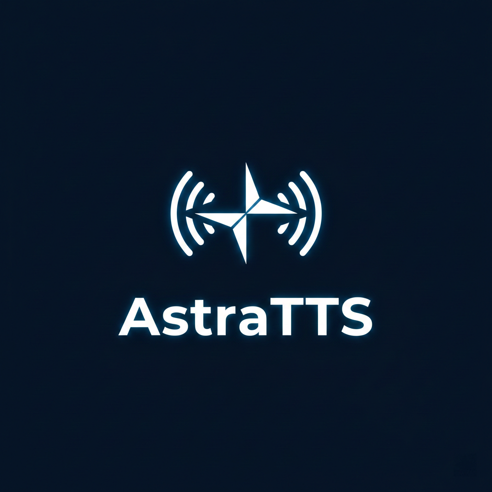
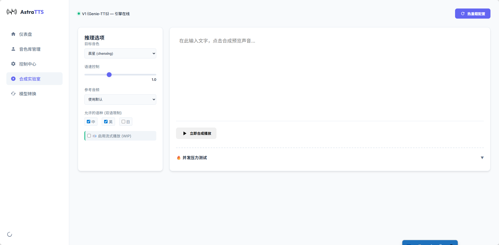
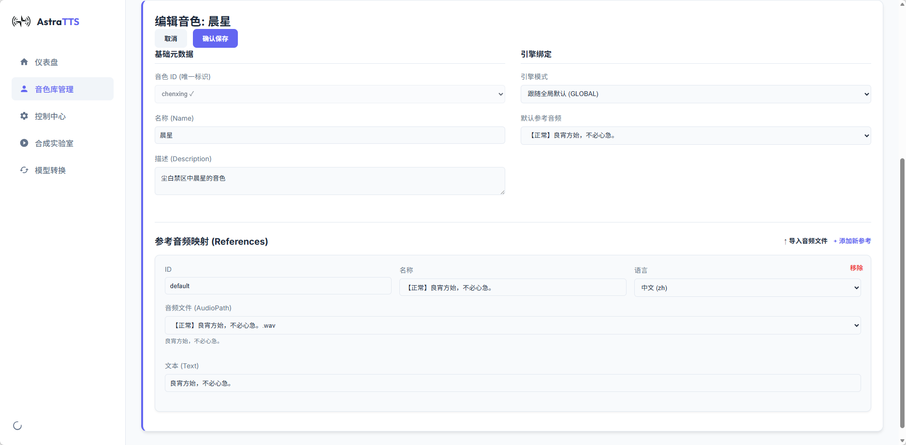
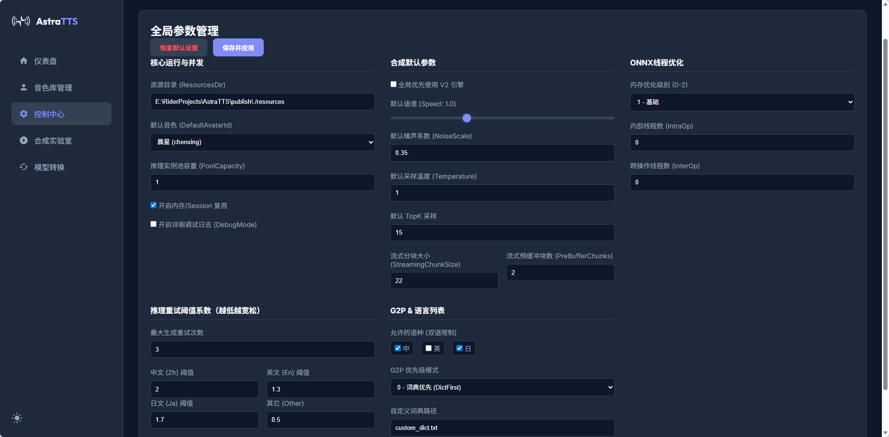
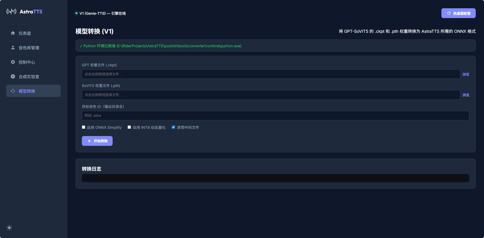

# AstraTTS

<p align="center">
  
</p>

<p align="center">
  <strong>🎙️ High-Performance Cross-Platform TTS (Text-to-Speech) Engine</strong>
</p>

<p align="center">
  A high-performance speech synthesis solution based on ONNX Runtime, supporting streaming output, concurrent inference, and multi-voice management.
</p>

<p align="center">
  English | <a href="./README.md">中文</a>
</p>

<p align="center">
  <a href="https://jq.qq.com/?_wv=1027&k=yvN60wYc"></a>
</p>

> [!IMPORTANT]
> **Important Notice**: Due to the large size of core models and high Git LFS overhead, this project has **stopped using Git LFS**. Core resources (`resources-minimal`) have been moved to [GitHub Releases](https://github.com/Blackwood416/AstraTTS/releases) for independent hosting. **Users building from source or using Docker must manually download the resource package and extract it to the project root directory.**

---

## 📢 New Version v1.2.1 Released!

AstraTTS v1.2.1 brings comprehensive deployment optimizations and experience upgrades, particularly for Linux and containerized environments.

### ✨ New Features & Improvements
- 🐳 **Native Docker Support** - Includes a streamlined Dockerfile for deployment, built on `.NET 10 (Ubuntu Noble)` and a native Python environment. Extremely fast and easy zero-config startup setup. Dependencies like `apt` and `pip` are pre-configured to use Tsinghua mirrors by default for network acceleration in mainland China.
- 🔄 **WebUI Quick Reset** - The Web management dashboard now features a one-click reset option, making it convenient for users to initialize or restore disorganized global configurations, optimizing the debugging experience.
- 🐧 **Linux Audio Adaptation** - The audio playback component in the CLI for Linux environments now features intelligent silent fallback handling (`pw-play` -> `paplay` -> `aplay`), significantly improving compatibility across different distributions.
- 🚀 **Full v2ProPlus & Concurrency Support** - Continues to maintain and optimize parallel loading capabilities and concurrent synthesis processing for models based on the GPT-SoVITS V2ProPlus architecture.

---

## ✨ Features

- 🚀 **High-Performance Inference** - Powered by ONNX Runtime and deeply optimized for CPU instruction sets, making inference speeds far faster than traditional Python execution.
- ⚖️ **High Concurrency Support** - Built-in inference pool design allows simultaneous processing of multiple synthesis requests, fully utilizing multi-core CPU resources.
- 🎵 **Streaming Output** - Millisecond-level first-chunk latency, supporting "play-while-synthesizing" to say goodbye to stuttering.
- 🎭 **Visual Management** - Powerful WebUI dashboard covering voice bank management, model conversion, and parameter tuning.

<div style="display: flex; justify-content: space-around; flex-wrap: wrap;">
  
  
  
  
</div>

- 🐧 **Multi-Platform Support** - Native support for Windows 10/11, with full compatibility achieved for Linux (such as Ubuntu, Arch, WSL).
- 🌐 **Multi-Language Support** - Robust support for ZH-EN and ZH-JA bilingual mixing (trilingual mixing is still in development).
- 🔄 **Hot Reload** - Configuration changes can take effect immediately while the service is running.

---

## 📦 Installation and Deployment Guide

### 1. Portable Package Quick Start (Windows / Linux)
For users in mainland China, it is highly recommended to download the fully integrated environment packages (containing all runtime environments and default models) via **Quark Drive**.
- **Download Link**: [https://pan.quark.cn/s/416fa9f65f3b](https://pan.quark.cn/s/416fa9f65f3b)
- **Access Code**: `y8Wx`

#### For Windows Users (`-win64.zip`):
1. **Download and Extract** the integration package.
2. **Start Web Dashboard**: Run `astra-server.exe`.
3. **Access Interface**: Open `http://localhost:5000` in your browser.
   - Use the "Converter" tab to import your SoVITS models.
   - Use the "Avatars" tab to upload reference audios and tune parameters.
4. **CLI Single Playback**: Run `astra-cli.exe` for local low-latency reading.

#### For Linux Users (`-linux64.tar.gz`):
1. **Download and Directly Extract**: `tar -xzvf AstraTTS-v*-linux64.tar.gz`
2. **Initialize Converter Environment**: 
   - Because the Linux environment does not embed the hundreds of MBs required for the Python build environment, you need to manually initialize the dependencies.
   - Run in the extracted root directory: `./init-env.sh` (this script will automatically set up the required lightweight virtual environment under `tools/converter/.venv`).
3. **Start the Engine**:
   - `chmod +x astra-server && ./astra-server` to start the Web service.
   - For local CLI testing, you can similarly execute `./astra-cli --text "Testing"`.

### 2. Docker Deployment (Recommended for Servers)
The project includes a Dockerfile optimized by multi-stage builds. You can deploy it by downloading the standalone model package (`resources-minimal`):

- **Resource Acquisition**: Due to the large size of the core models, they are no longer hosted via Git LFS. Please go to [GitHub Releases](https://github.com/Blackwood416/AstraTTS/releases) to download `resources-minimal.zip`, and extract it into the `resources-minimal` folder within the source root directory.

```bash
# 1. Clone the code repository
git clone https://github.com/Blackwood416/AstraTTS.git
cd AstraTTS

# 2. Prepare model resources
# Fast download and extract core resources from GitHub Releases
wget https://github.com/Blackwood416/AstraTTS/releases/latest/download/resources-minimal.zip
unzip resources-minimal.zip
rm resources-minimal.zip

# 3. Super-fast Docker image build (Optimized for domestic networks, apt and pip dependencies use Tsinghua mirrors by default. The docker image utilizes acceleration nodes provided by the Dodo mirror sync station https://docker.aityp.com/. If you find the node inaccessible, you can manually modify the registry mirror in the Dockerfile)
docker build -t astratts-server:latest .

# 4. Run the container
# It is recommended to mount the local resources directory into the container via the -v parameter, so you can manage and update model files on the host machine at any time.
docker run -d --name astratts \
  -p 5000:5000 \
  -v ./resources:/app/resources \
  astratts-server:latest
```

After the container starts, access `http://localhost:5000` in your browser to see the complete Web management dashboard. Config hot-reloading, voice bank management, AND model conversion UI are all fully supported while running inside the container.

### 3. LAN Access (Cross-Device Usage)

If you want to access the Web dashboard from other phones or computers on the same local network, you can use ASP.NET's built-in command-line argument `--urls` to specify listening on all network interfaces:

- **Windows**: Open a terminal (PowerShell or CMD) and run `.\astra-server.exe --urls "http://0.0.0.0:5000"`
- **Linux**: Run `./astra-server --urls "http://0.0.0.0:5000"`

After starting, simply enter the LAN IP address of this computer in the browser of other devices to access it (for example, `http://192.168.1.100:5000`).

---

## 📦 Project Structure

- **AstraTTS.Core**: Core SDK, containing the hybrid G2P engine, RoBERTa/Hubert feature extractors, and high-performance inference engines for various versions.
- **AstraTTS.CLI**: Command-line interactive tool. Supports low-latency WASAPI playback on Windows; piped adaptation for `aplay`/`paplay`/`pw-play` audio backends on Linux.
- **AstraTTS.Web**: Backend Web service, integrating the full suite of WebUI management functions, supporting headless deployment on Linux servers.

---

## 🔧 Engine Version Comparison

AstraTTS uses the **V1 Engine (Recommended)** by default. V2 is currently still in an early stage of maturity.

| Feature | V1 Engine (Recommended) | V2 Engine (Experimental) |
| :--- | :--- | :--- |
| **Origin** | Based on [Genie-TTS](https://github.com/High-Logic/Genie-TTS) | Based on [GPT-SoVITS-Minimal](https://github.com/GPT-SoVITS_minimal) |
| **Status** | ✅ Stable, supports **V2ProPlus** cloning | 🚧 In Development (WIP) |
| **Language** | ✅ ZH-JA mix / ZH-EN mix (Bilingual) | ⚠️ ZH-EN Only |
| **Sampling** | ❌ Deterministic (No TopK/Temp) | ✅ Supports TopK / Temp / NoiseScale |
| **Concurrency** | ✅ Supported (Inference Pool) | ✅ Supported |

---

#### 📂 Model and Resource Directories

Resource structure (v1.1.x+):

```text
resources/
├── models_v1/                   # V1 Engine Models (Flattened)
│   └── {avatarId}/              # Core vits.onnx location
├── models_v2/                   # V2 Engine Models
│   └── {avatarId}/              # sovits.onnx, etc.
├── shared/                      # Base Resources
│   ├── g2p/                     # JA/ZH/EN dictionaries & models
│   ├── v1_extra/                # Common Bert/Hubert components
├── avatars/                     # Voice Library
│   └── {avatarId}/              # Reference audio directory
```

---


## ⚙️ Configuration Guide (`config.yaml`)

The new version has fully transitioned to YAML format. Below is an example of core configuration items (see `config.template.yaml` for full details):

```yaml
ResourcesDir: "resources"      # Resource location
DefaultAvatarId: "default"     # Default voice

# Performance Settings
IntraOpNumThreads: 0           # 0 for automatic thread count
InterOpNumThreads: 1           # Inter-operator parallelism

# Engine & Inference
UseEngineV2: false             # Default to V1 
Speed: 1.0                     # Default speed
StreamingMode: true            # Enable streaming

# Voice Definitions
Avatars:
- Id: default
  Name: "My Voice"
  References:
  - Id: normal
    AudioPath: "ref.wav"
    Language: "zh"             # Specify reference audio language
```

---

## 🚀 Developer Quick Start (Building from Source)

### Runtime Environment
- .NET 10.0 SDK.
- **Windows**: 10/11 (x64/arm64).
- **Linux**: Supports major distributions based on x86_64 or ARM64 (e.g., Ubuntu 22.04+, Arch Linux, WSL2).
  - **Linux Dependencies**: Needs `dotnet-runtime-10.0` installed.
  - **Linux Playback**: In CLI mode, it's recommended to install `alsa-utils` (`aplay`) or `pulseaudio` (`paplay`).

### Build & Publish
- **Windows**: Run `publish.ps1`.
- **Linux**: Run `publish-linux.sh`.

## 📄 License
MIT License

## 🙏 Acknowledgments
- [Genie-TTS](https://github.com/High-Logic/Genie-TTS) - Core architecture reference for the V1 inference engine.
- [GPT-SoVITS](https://github.com/RVC-Boss/GPT-SoVITS) - Algorithm source for the V2 engine.
- [GPT-SoVITS Minimal Inference](https://github.com/GPT-SoVITS-Devel/GPT-SoVITS_minimal_inference) - C# inference implementation reference for V2.
- [ONNX Runtime](https://onnxruntime.ai/) - High-performance cross-platform inference backend.
- [NAudio](https://github.com/naudio/NAudio) - .NET audio processing.
- [wasapi_relink](https://github.com/Litttlefish/wasapi_relink) - WASAPI low-latency helper component.
- [BreakingBad (AI-Hobbyist)](https://www.ai-hobbyist.com/thread-1143-1-1.html) - Source of the built-in default models for the integration package.
